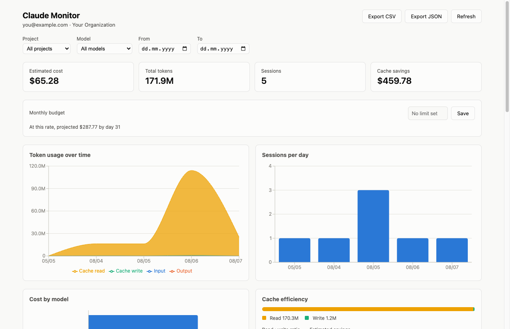

# Claude Monitor

[](https://github.com/rhasan33/claude-monitor/actions/workflows/ci.yml)

A desktop app that gives you a 360° view of how you use [Claude Code](https://claude.com/claude-code): token usage, cost, prompt-cache efficiency, and per-project/per-model breakdowns — all computed locally from the session logs already on your machine. Nothing is uploaded anywhere.

Built with Electron, TypeScript, and React.



## Status

Under active development. Current state:

- [x] Project scaffold (Electron + Vite + React + TypeScript)
- [x] Pluggable usage-source abstraction (`src/main/sources`)
- [x] Claude Code local-log parser (`src/main/sources/claude-code-local`)
- [x] Cost calculation from a versioned model-pricing table
- [x] Usage aggregation (daily/model/project rollups, cache efficiency)
- [x] Profile (`~/.claude.json`) and recent-activity (`history.jsonl`) readers
- [x] IPC bridge between the main process and the renderer
- [x] Dashboard UI (summary cards, token/cache/model/project charts, activity feed, filters)
- [x] Packaged build (macOS)

## Requirements

- Node.js 20+ (LTS recommended)
- macOS, Windows, or Linux with Claude Code already used at least once (the app reads `~/.claude/`)

## Install

```sh
npm install
```

## Run in development

```sh
npm run dev
```

## Other scripts

| Command | What it does |
|---|---|
| `npm run dev` | Launch the app in development mode (hot reload) |
| `npm run build` | Type-check and build the app for production |
| `npm run typecheck` | Type-check the main, preload, and renderer processes |
| `npm test` | Run the unit test suite |
| `npm run lint` | Lint the codebase with ESLint |
| `npm run package` | Build a double-clickable universal (Intel + Apple Silicon) `.app` and a `.dmg` installer (macOS) into `release/` |

A `Makefile` wraps these for convenience — run `make` with no arguments to see the full list. The most relevant for day-to-day use:

```sh
make open        # build the .app (if needed) and launch it
make install-app # copy the .app to /Applications, so it's launchable from Spotlight/Launchpad like any other app
make dmg         # build the .dmg installer and reveal it in Finder
```

The packaged app is unsigned (no paid Apple Developer certificate) but ad-hoc signed, which is enough to launch normally on this machine via double-click. If you move the `.app` or `.dmg` to another Mac through a channel that applies macOS's quarantine flag (a download link, AirDrop, email, etc.), Gatekeeper will block the first launch — often with the stronger "Apple could not verify \[...\] is free of malware" dialog rather than a simple one-time prompt. To resolve it on that Mac:

- Right-click (or Control-click) the app → **Open** → confirm in the dialog. If that doesn't offer a bypass, open **System Settings → Privacy & Security**, scroll to the security section, and click **Open Anyway** next to the blocked-app notice, then try opening it again.
- Or, from Terminal: `xattr -cr "/Applications/Claude Monitor.app"` (strips the quarantine flag directly; works even when the dialog offers no bypass).

This is a Gatekeeper/notarization limitation, not a bug in the app — actually removing the warning requires notarizing with a paid Apple Developer ID certificate, which this project doesn't currently have.

## How it works

The app reads directly from Claude Code's local data directory — no network calls, no account required beyond what Claude Code itself already stores:

- `~/.claude/projects/**/*.jsonl` — per-session transcripts, the source of all token/model/tool-usage data.
- `~/.claude.json` — account/profile info and Claude Code's own last-session summaries (used as a sanity check, not the source of truth for history).
- `~/.claude/history.jsonl` — recent command history, feeds the activity view.

See `src/main/sources/types.ts` for the `UsageSource` interface — the data model is designed so a future source (e.g. the Anthropic Admin API, or your own instrumented API usage) can be added without reworking aggregation or the UI.

Cost estimates are derived from a versioned pricing table (`src/main/lib/pricing.ts`) rather than a field in the logs (Claude Code doesn't record cost per message). Anthropic's published rates change over time, so double-check the table against Anthropic's current pricing page before trusting a cost number.

## Contributing

See [CONTRIBUTING.md](CONTRIBUTING.md).

## License

[GPL-3.0](LICENSE) © 2026 Rakib Hasan Amiya
